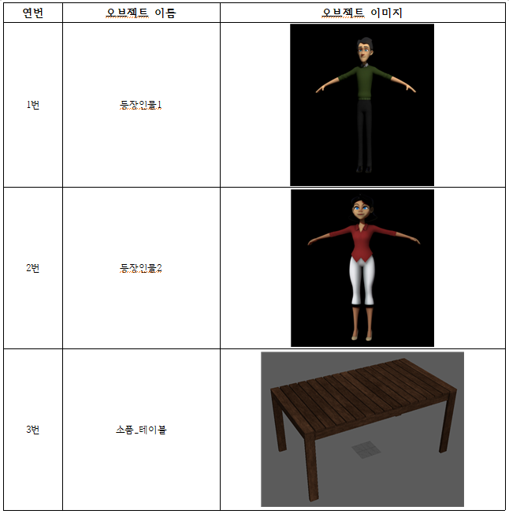
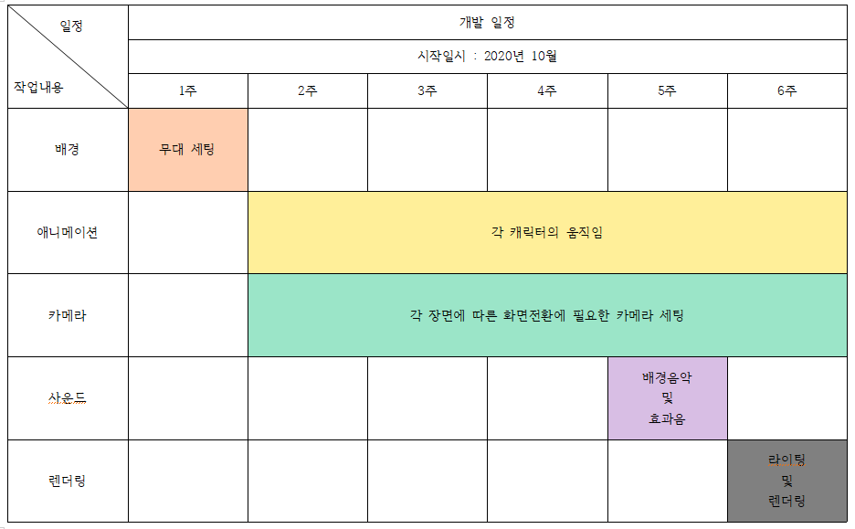
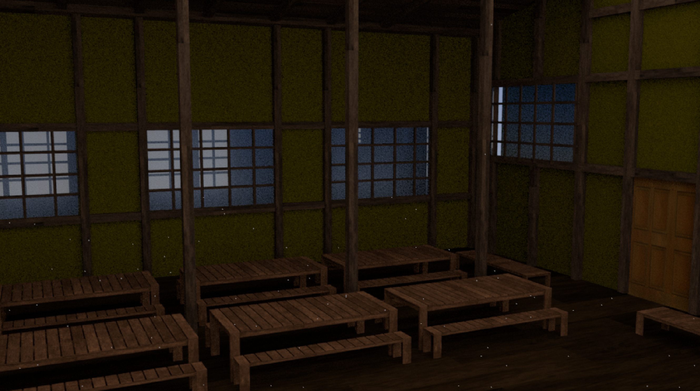
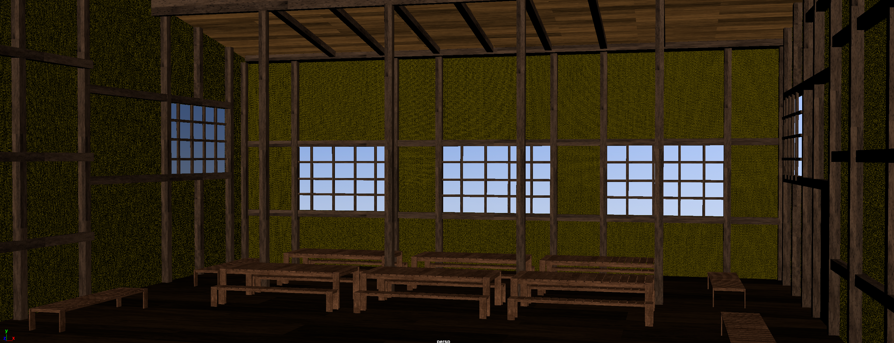

# 애니트릭스

 

# [목차]
## 1. [컨셉](#컨셉)  
## 2. [관련 이미지 및 동영상](#관련-이미지-&-동영상)  
## 3. [컨셉 및 대표이미지 기반 작품묘사](#컨셉-&-대표이미지-기반-작품묘사)  
## 4. [구성요소]([#<애니트릭스>-구성-요소])  
## 5. [작품 오브젝트 분해](#작품-시스템-디자인)  
## 6. [개발작업 시간표](#개발작업-일정(6주))  
## 7. [결과](#결과)

 

# [컨셉]
> ## 메인 컨셉 : 액션
* 영화 매트릭스의 한 장면인 주인공이 시험을 받기위해  
자신의 무술을 보여주는 장면을 3D 마야를 이용하여 표현한다.

 

> ### 서브 컨셉 : 속도감
- 보는 이로 하여금 액션감을 느끼게 만들려면 속도감이 중요함으로  
 순간적으로 캐릭터가 치고 빠지는 느낌을 표현한다.

 

> ### 서브 컨셉 : 아크(ARCS)
* 단순히 손과 발이 일직선으로 뻗기 보단 포물선을 그리는 곡선을 표현한다.

 

> ### 서브 컨셉 : 스테이징
- 액션씬은 주변 사물도 영향을 받기 때문에 무대 연출을 위해 배경을 제작한다.

 

> ### 서브 컨셉 : 카메라
* 단순히 한 개의 카메라가 영화를 처음부터 끝까지 찍는다면 몰입감이나 재미가 떨어진다.  
여러 개의 카메라를 이용하여 화면 전환을 통해 보는 이로 하여금 집중할 수 있게 한다.

 

> ### 서브 컨셉 : 자연스러움
- 주인공의 움직임을 표현하다보니 사람의 행동을 기준으로 보았을 때  
자연스럽지 않으면 집중감이 떨어지게 된다. 보는 이로 하여금 정말 사람처럼  
움직인다고 생각할 수 있게 표현한다.

  

# [관련 이미지 & 동영상]
* 이미지

 

* 동영상

  

# [컨셉 & 대표이미지 기반 작품묘사]
> ### 대표이미지 기반 :   
- 해당 이미지는 복제된 스미스 요원과 주인공이 격투를 벌이는 장면이다.  
스미스 요원은 각성하여 다른 사람들을 또다른 자신으로 덮어씌울수 있게 되자,  
주인공도 스미스 요원처럼 만들기 위해 격투를 벌이는 장면이다.  
이 장면으로 작품을 만드는 것이 아니라 이러한 액션씬을 만들기 위함으로  
컨셉이미지가 이해하기 쉽게 하고자 예를 들었다.

 

> ### 컨셉 기반 :   
* 주인공(좌)은 세라프(우)와 단순히 싸우는 것이 아닌, 시험을 받는 중이다.  
세라프는 주인공을 오라클에게 데려가기 전 믿을 수 있는지 확인하기 위해 대전을 요청했고,  
주인공은 이에 응했다. 이 액션씬은 속도감 있지만 단순히 팔, 다리를 뻗는 것이 아닌   
곡선을 그리며 서로 합을 주고 받는다. 더해 테이블을 옮겨다니는데 카메라 또한 중간중간 전환되어  
보는 이로 하여금 지루하지 않게 만들예정이다.

  

# [<애니트릭스>> 구성 요소]

## 매커니즘
> ### 도전과제
* 세라프의 시험을 통과하고 오라클을 만나라

 

> ### 재미요소
- 화려한 액션씬
* 상황에 맞는 카메라 전환

 

## 이야기
> ### 메인스토리
- 주인공은 세라프의 대전 요청을 받아들이고 자신의 무술을 보여준다.

 

> ### 메인스토리 설명
- 세라프는 주인공을 오라클에게 데려가기 전 믿을 수 있는 사람인지 확인하기 위해 대전을 요청했고, 주인공은 이에 응했다.  
결국 주인공은 세라프의 시험을 통과하여 자신의 신뢰를 보여주고 오라클을 만날 수 있게된다.

 

## 이야기 추가설명 
> ### [명분]
* 주인공은 선택받았지만 오라클에게 데려갈 정도로 믿을 수   있는 사람인지 확인하기 위해 대전을 요청한 것은 명분이 있다.

 

## 미적요소
> ### 디자인
- 기본적으로 리깅이 되어있는 모델링 파일을 이용하여 영화 캐릭터와는 다르지만 관점을 달리 보면   
영화 캐릭터와 같지 않기 때문에 느낌이 색다름

 

> ### 컬러
* 메인 캐릭터 : 모델링 파일에 적용되어있는 컬러
- 배경 : 영화의 배경과 최대한 비슷한 색감

 

> ### 음향
- 메인 음향 : 박진감 넘치는 영화 배경음악
* 서브 음향 : 캐릭터간의 접촉이 있거나, 배경사물과 접촉하였을 때 발생하는 특정 음향

 

# [작품 시스템 디자인]
> ## 작품 오브젝트 분리

 

> ## 작품목표
### 1. 핵심목표
- 등장인물들의 움직임을 자연스럽게 표현  
* 각 장면에 맞는 카메라 전환
### 2. 보조목표
- 자연스러운 라이팅을 통한 배경표현
* 소품을 활용한 추가적인 움직임 표현 

 

# 개발작업 일정(6주)

 

## 주차별 세부계획
* 1주차 목표 : 작품의 무대가 되는 환경 제작
- 2주차 목표 : 각 캐릭터의 기본적인 움직임 제작
* 3주차 목표 : 기본 움직임을 토대로 카메라 세팅
- 4주차 목표 : 세부 움직임 묘사와 카메라 움직임 설정
* 5주차 목표 : 캐릭터 얼굴 애니메이션 제작 및 사운드 적용
- 6주차 목표 : 추가 애니메이션 작업 및 라이팅과 랜더링 세팅

 

### 1. 배경
- 무대로 사용되는 배경 제작
* 사용되는 소품을 적절하게 배치  

### 2. 애니메이션
- 등장인물이 2명이므로, 각 등장인물의 움직임을 1초씩 번갈아 가며 작업
* 모든 장면의 움직임을 미리 선정하지 않고 1초씩 작업
> 추가설명 : 댄스 애니메이션 제작 때 움직임이 자연스럽지 않았던 이유는 미리 전체 움직임을 임시로 선정해놓은 결과,  
앞부분 움직임을 수정하니 나머지 뒷부분도 전체 수정하게 되어 질이 떨어지고 더 많은 시간을 투자함  

### 3. 카메라
- 등장인물들이 각 장면의 움직임을 표현한 후 장면전환을 위한 카메라 세팅
> 추가설명 : 댄스 애니메이션 제작처럼 모든 애니메이션 작업을 끝내고 카메라 세팅을 한 경우 장면전환이 매끄럽지 못하고  
카메라 각도에 따라 등장인물의 움직임을 다시 수정해야하는 상황이 있었기에 자연스러운 움직임을 위해 애니메이션과  
카메라 세팅을 동시에 작업하는 것이 최종 결과물이 더 좋다고 생각함  

### 사운드
* 영화의 기본 배경음악이나 효과음을 적용  

### 렌더링
- 무대 소품 및 배경의 텍스쳐 제작
* 실내 라이팅을 적용
> 추가설명 : 바로 렌더링을 하면 라이팅이 적용되지 않아 배경을 포함한 모든 장면이 밋밋하기에  
실내 라이팅을 적용하여 진짜 영화 같은 느낌을 표현하고자 함  

 

# [결과]
> 이미지

