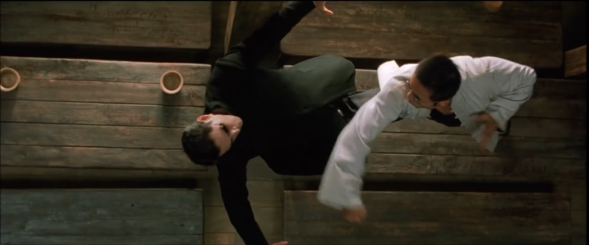
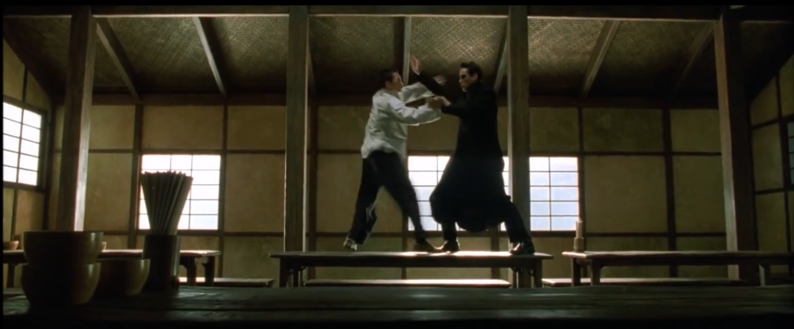
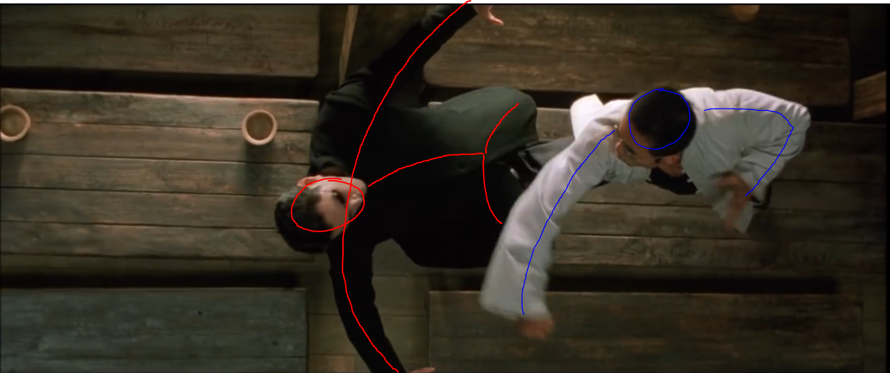

# [컨셉]
> ## 메인 컨셉 : 액션
* 영화 매트릭스의 한 장면인 주인공이 시험을 받기위해  
자신의 무술을 보여주는 장면을 3D 마야를 이용하여 표현한다.

 

> ### 서브 컨셉 : 속도감
- 보는 이로 하여금 액션감을 느끼게 만들려면 속도감이 중요함으로  
 순간적으로 캐릭터가 치고 빠지는 느낌을 표현한다.

 

> ### 서브 컨셉 : 아크(ARCS)
* 단순히 손과 발이 일직선으로 뻗기 보단 포물선을 그리는 곡선을 표현한다.

 

> ### 서브 컨셉 : 스테이징
- 액션씬은 주변 사물도 영향을 받기 때문에 무대 연출을 위해 배경을 제작한다.

 

> ### 서브 컨셉 : 카메라
* 단순히 한 개의 카메라가 영화를 처음부터 끝까지 찍는다면 몰입감이나 재미가 떨어진다.  
여러 개의 카메라를 이용하여 화면 전환을 통해 보는 이로 하여금 집중할 수 있게 한다.

 

> ### 서브 컨셉 : 자연스러움
- 주인공의 움직임을 표현하다보니 사람의 행동을 기준으로 보았을 때  
자연스럽지 않으면 집중감이 떨어지게 된다. 보는 이로 하여금 정말 사람처럼  
움직인다고 생각할 수 있게 표현한다.

  

# [관련 이미지 & 동영상]
- 이미지  

 

* 동영상

  

# [컨셉 & 대표이미지 기반 작품묘사]
- ### 대표이미지 기반 :   
> 해당 이미지는 복제된 스미스 요원과 주인공이 격투를 벌이는 장면입니다.  
스미스 요원은 각성하여 다른 사람들을 또다른 자신으로 덮어씌울수 있게 되자,  
주인공도 스미스 요원처럼 만들기 위해 격투를 벌이는 장면입니다.  
이 장면으로 작품을 만드는 것이 아니라 이러한 액션씬을 만들기 위함으로  
컨셉이미지가 이해하기 쉽게 하고자 예를 들었습니다.

 

- ### 컨셉 기반 :   
> 주인공(좌)과 세라프(우)는 단순히 싸우는 것이 아닌, 시험을 받는 중입니다.  
세라프는 주인공을 오라클에게 데려가기 전 믿을 수 있는지 확인하기 위해 대전을 요청했고,  
주인공은 이에 응했습니다. 이 액션씬은 속도감 있지만 단순히 팔, 다리를 뻗는 것이 아닌   
곡선을 그리며 서로 합을 주고 받습니다. 더해 테이블을 옮겨다니는데 카메라 또한 중간중간 전환되어  
보는 이로 하여금 지루하지 않게 만들예정입니다.

  

# [<애니트릭스>> 구성 요소]

## 매커니즘
> ### 도전과제

* 세라프의 시험을 통과하고 오라클을 만나라

 

> ### 재미요소
- 화려한 액션씬
* 적절한 카메라 전환

 

## 이야기
> ### 메인스토리
- 세라프는 주인공을 오라클에게 데려가기 전 믿을 수 있는 사람인지 확인하기 위해 대전을 요청했고, 주인공은 이에 응했습니다.  
주인공은 과연 세라프의 시험을 통과하여 자신의 결백함을 보여주고 오라클을 만날 수 있을 것인가?

 

## 미적요소
> ### 디자인
- 기본적으로 리깅이 되어있는 모델링 파일을 이용하여 영화 캐릭터와는 다르지만 관점을 달리 보면   
영화 캐릭터와 같지 않기 때문에 느낌이 색다름

 

> ### 컬러
* 메인 캐릭터 : 모델링 파일에 적용된 컬러
- 배경 : 영화의 배경과 최대한 비슷한 색감

 

> ### 음향
- 메인 음향 : 박진감 넘치는 배경음악
* 서브 음향 : 캐릭터간의 접촉이 있거나, 배경사물과 접촉하였을 때 특정 음향

 
